# Floodead-Inside

## Satellite Imagery Analysis for Flood Detection: Enhancing Disaster Response and Mitigation

## Introduction

Natural disasters, such as floods, have a significant impact on human lives, infrastructure, and the environment. Timely and accurate detection of flood events is crucial for effective disaster response and mitigation efforts.   

Satellite imagery analysis has emerged as a powerful tool in detecting and monitoring floods from a large-scale perspective.  

By leveraging the capabilities of satellite technology, we can obtain valuable insights into flood dynamics, extent, and severity, enabling early warning systems and facilitating efficient resource allocation during flood events.

## Objective

The objective of this project is to develop a robust flood detection system using satellite imagery.  
By harnessing the wealth of data captured by satellites, we aim to identify and map flood-prone areas, track flood progression, and provide near real-time information to aid disaster management agencies, policymakers, and first responders.   
Through advanced image processing and machine learning techniques, we seek to automate the flood detection process and provide accurate and timely information to support decision-making in flood-prone regions.

## Methodology

The project will utilize state-of-the-art satellite imagery.  
The imagery will undergo preprocessing steps to enhance its quality and facilitate feature extraction.  
Advanced image processing algorithms, such as dark object subtraction, color preprocessing, and classification, will be employed to identify flooded areas and distinguish them from other land cover types.   
Machine learning and deep learning algorithms, including supervised and unsupervised methods, will be trained on the datasets to improve the accuracy of flood detection and enable automated analysis of new satellite images.

## Pipeline

1. Data Acquisition: Acquiring high-resolution satellite imagery from reliable sources, including optical and SAR sensors, covering flood-prone regions. N.B. This dataset was already provided.
2. Exploratory Data Analysis: Conducting exploratory data analysis to gain insights into the data and identify any issues that may affect the performance of the flood detection system.
3. Preprocessing: Implementing image preprocessing techniques to correct for atmospheric effects, noise, and other artifacts, ensuring the quality of the data.
4. Feature Extraction: Employing advanced image processing techniques to extract relevant features, such as HOG, texture, and color characteristics, for flood identification.
5. Classification: Developing machine learning and deep learning models to classify flooded and non-flooded areas/images based on extracted features, using labeled training datasets.
6. Validation and Evaluation: Assessing the accuracy and performance of the flood detection system through validation against ground truth data and benchmarking against existing flood maps using F1 score, precision, and recall.
7. Visualization and Reporting: Visualizing the detected floods on maps and generating comprehensive reports that provide actionable information for disaster management agencies and stakeholders.

## Pipeline in Depth

### Data Acquisition

We have got a dataset that consists of 922 satellite images of the different areas taken at different times. It includes a mix of images, with and without floods. The images are in the form of 3-channel RGB images of size 512x512 pixels.

### EDA

We have conducted a simple exploratory data analysis to be more familiar with the data and to get a better understanding of the problem. The following are some of the insights
Some Insights:

- The classes are evenly distributed. Hence, there is no need to use any data balancing algorithms like SMOTE, ...

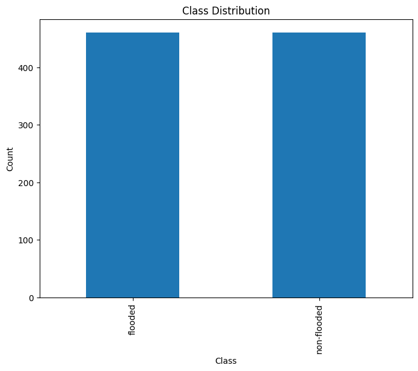

- We tried to extract some image statistics:

|        |     Red     |    Green    |     Blue    |
|:-----: |:----------: |:----------: |------------ |
| count  | 922.000000  | 922.000000  | 922.000000  |
|  mean  | 115.954649  | 117.000217  | 102.267569  |
|  std   |  28.291652  |  26.237876  | 28.510193   |
|  min   |  35.726889  |  41.423950  | 26.471636   |
| 25%    | 101.062540  | 101.448852  | 85.816433   |
| 50%    | 117.331860  | 117.185117  | 102.884859  |
| 75%    | 133.805298  | 132.525689  | 119.731043  |
| max    | 221.244049  | 221.544763  | 215.234698  |

- We have plotted some samples and noticed the following:
  - Some non-flooded images have high values in the blue channel. This might be a problem for our model.
  - Some images have very high brightness values.
  - Some flooded images have muddy water. This might also be a problem for our model.
  - Some images contain glass windows which reflected the water. This will make the pixel-by-pixel segmentation very hard.
  - Some images are very hard to classify even for humans!

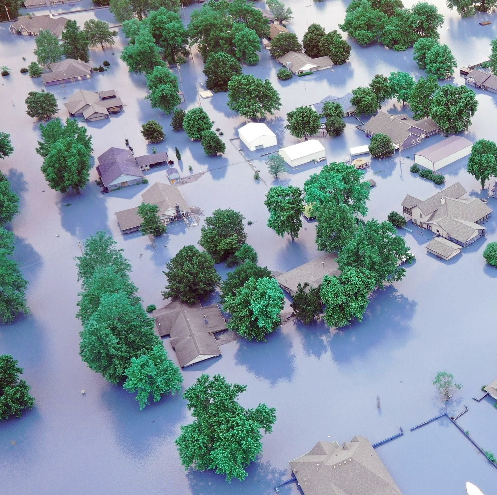
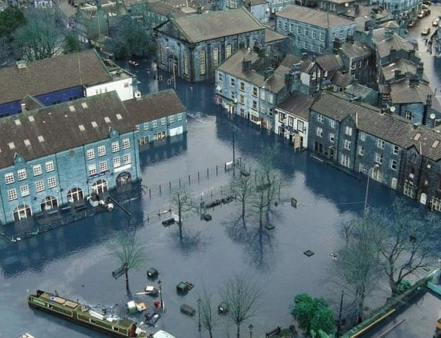
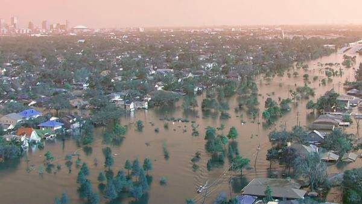

### Preprocessing

We have conducted several image processing techniques to enhance the quality of the data and facilitate feature extraction. The following are some of the techniques we have used:

- Dark Object Subtraction for Haze Removal: Dark Object Subtraction is important for haze removal as it helps to enhance visibility and improve image quality by reducing the atmospheric haze.
- Histogram Equalization: Histogram Equalization is important for improving the contrast and enhancing the overall appearance of an image by redistributing the pixel intensities.
- Contrast Stretching: Contrast Stretching is important for enhancing image details and improving the dynamic range by expanding the range of pixel intensities. We did it by performing a linear scaling for the pixel values between the desired minimum and maximum intensity levels.
- Sharpening Filters: Sharpening filters are important for enhancing image details and improving edge definition. They help to emphasize high-frequency components and increase image sharpness.
- Denoising Filters: Denoising filters are important for reducing noise and improving image quality by removing unwanted artifacts and preserving important details. OpenCV provides various denoising filters, such as the Bilateral Filter (`cv2.bilateralFilter()`), which can be used to effectively reduce different types of noise in images. and the Non-Local Means Denoising algorithm (`cv2.fastNlMeansDenoising()`).  We used the later.

### Feature Extraction

We have extracted several features from the images to be used in the classification step. Here's what we did.

We thought that the color is the most important and obvious feature to detect floods. Hence we started using some color-based features, like:

- **Average Color**: Calculate the average color values for the image.
- **Color Histogram**: Compute the distribution of color values in the image.

We also thought that dimensions and contours is a very important features, for example, images with floods contains significantly different number of contours than images with no floods, the size of the contours and aspect ratios of the image is also important. Hence we used the following Shape-based Features:

- **Contour Area**: Compute the area of the object contours in the image.
- **Aspect Ratio**: Calculate the ratio of the image width to its height.

Finally, we became aware that the texture is the most critical feature in our problem. Flooded images has a very different texture than non-flooded images. Hence we used the following Texture-based Features:

- **Gray-Level Co-occurrence Matrix (GLCM)**: Computes the distribution of co-occurring pixel values in different directions.
- **HOG (Histogram of Oriented Gradients)**: It represents the local shape and texture information of an image by capturing the distribution of gradients in different regions.
- **Local Binary Patterns (LBP)**: Captures the patterns in the texture of the image.

### Classification

### Machine Learning Classifier

We have implemented a machine learning classifier using the extracted features. We have used the following classifiers:

- **Gray-Level Co-occurrence Matrix (GLCM)**
- **HOG (Histogram of Oriented Gradients)**

After applying different classifiers we got the following results:

| Model   | Accuracy  | Balanced Accuracy   | F1 Score  | Time Taken  |
|:---:    |:---:      |:---:                |:---:      |:---:        |
| LGBMClassifier  | 0.90  | 0.90  | 0.90  | 19.69  |
| NuSVC  | 0.88  | 0.88  | 0.88  | 1.32  |   |
| RandomForestClassifier  | 0.88  | 0.88  | 0.88  | 2.99  |
| ExtraTreesClassifier  | 0.88  | 0.88  | 0.88  | 1.18  |
| SVC  | 0.87  | 0.87  | 0.87  | 1.06  |   |
| AdaBoostClassifier  | 0.86  | 0.86  | 0.86  | 19.59  |
| LogisticRegression  | 0.81  | 0.81  | 0.81  | 1.17  |
| CalibratedClassifierCV  | 0.80  | 0.80  | 0.80  | 6.19  |
| LinearSVC  | 0.80  | 0.80  | 0.80  | 1.82  |

Hence, we decided to go with the LGBMClassifier.

>> LGBMClassifier is a machine learning model based on the LightGBM framework that can be used for classification tasks. It uses a gradient boosting algorithm to create an ensemble of decision trees, where each tree is built by focusing on the instances that are difficult to classify, resulting in a fast and accurate model.

### Deep Learning Classifier

We have used the raw image without extracting any features to train the deep learning model. We have tried different pre-trained models and we got the following results:

| Architecture   | Accuracy  | F1-Score  |
|---: |---: |---: |
| ResNet18  | 93.51  | 0.93  |
| DenseNet  | 95.7  | 0.96  |
| ResNet50  | 96.77  | 0.97  |

We decided to go with the ResNet50 model.

<!-- TODO: add model architecture here -->

### Pixel-by-Pixel Segmentation

Pixel-by-pixel segmentation is a computer vision technique that involves labeling each pixel in an image by analyzing its characteristics to identify objects or regions in the image.  
Although it requires significant computational power and memory, it is useful for flood detection, as it enables accurate identification of flooded areas and provides information about the flood's extent and severity.

As our data was not originally intended for flood detection, we had to resort to an unsupervised learning algorithm to cluster the image pixels into two categories:  
  1. flooded 
  2. non-flooded.  
   
To achieve this, we employed the K-Means clustering algorithm, with color as our primary feature.   
This method allowed us to differentiate between flooded and non-flooded pixels, despite the absence of labeled data for supervised learning.

We got some fascinating results:

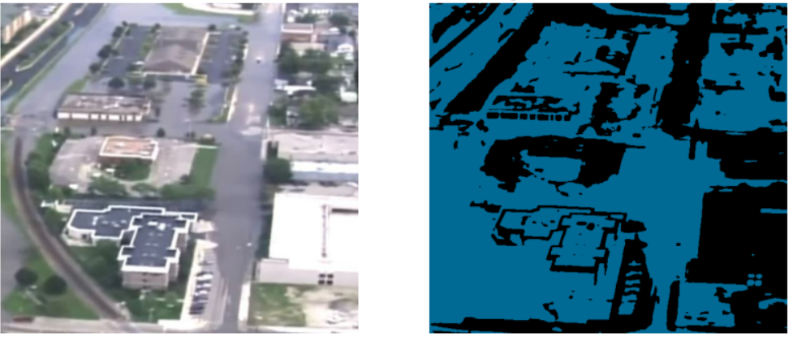
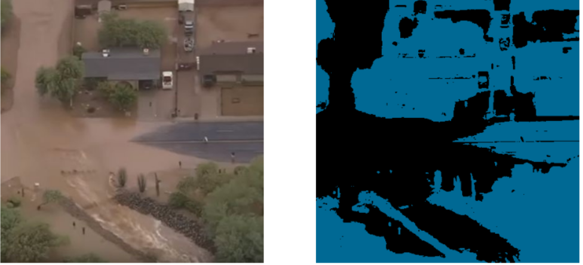
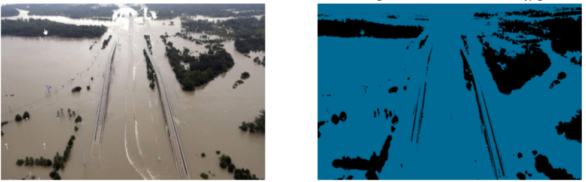

### Validation and Evaluation

For the image classification part, we used the accuracy, F1 score, precision, and recall as our evaluation metrics.

For the pixel-by-pixel segmentation part, we used the **Silhouette Coefficient** as our evaluation metric.

The Silhouette Coefficient is a measure of how well instances within a cluster are separated from instances in other clusters. It is calculated by considering the average distance between each instance and other instances within the same cluster, and comparing it to the average distance between the instance and instances in other clusters. A higher Silhouette Coefficient indicates better-defined and well-separated clusters, while a lower value suggests overlapping or poorly separated clusters.

### Segmentation with CAM (Class Activation Mapping)
Class Activation Mapping (CAM) is a technique used in computer vision that generates a heatmap highlighting the regions of an image that are important for a neural network's classification decision.  
It accomplishes this by using the weights of the last convolutional layer of the neural network to generate a class activation map, which indicates the contribution of each pixel in the image to the final classification decision.  
The resulting heatmap can be overlaid on the original image to provide visual explanations of the network's decision-making process.  

We computed CAM on the resnet50 model and applied Kmeans on the resulting heatmap to obtain the image mask for the image segmentation task.    

Here are some of the results:   

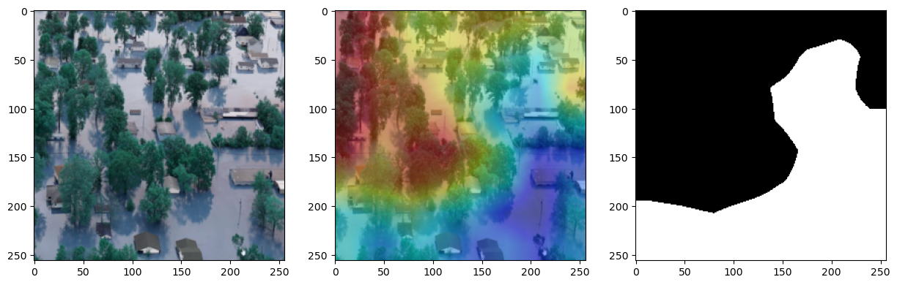
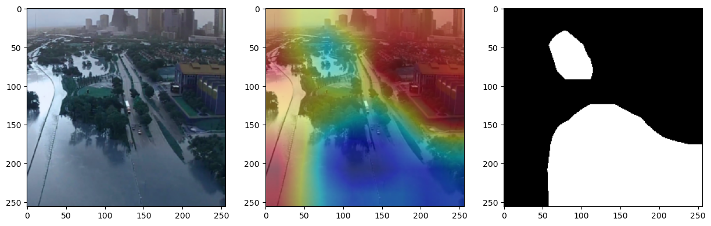
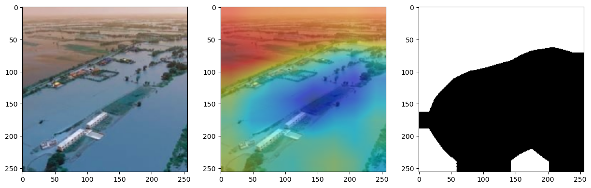
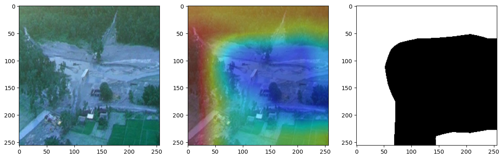

## Conclusion

Satellite imagery analysis has the potential to revolutionize flood detection and monitoring by leveraging the power of remote sensing technology.  
This project aims to harness the vast amount of satellite data available to develop an efficient and accurate flood detection system.   
By combining advanced image processing techniques and machine learning algorithms, we aspire to provide timely and reliable information to aid in flood disaster response, mitigation, and long-term planning.   
The outcomes of this project have the potential to make a significant positive impact on society by enhancing flood resilience and reducing the human and economic losses associated with floods.
